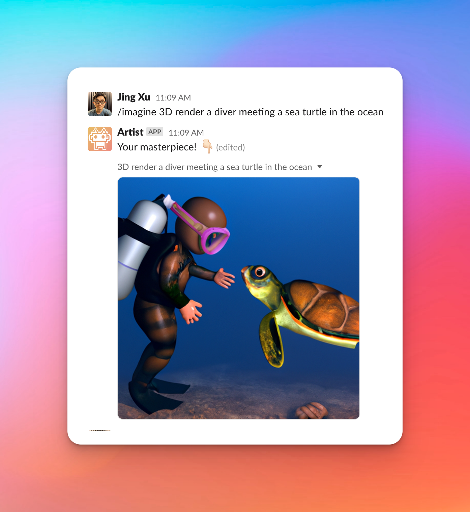

# Artist Chatbot

<!-- Badges area start -->

[](https://rightcapital.com)

[](https://conventionalcommits.org)
[](https://github.com/RightCapitalHQ/frontend-style-guide)

<!-- Badges area end -->

## Introduction

The Artist is a Slack chatbot with the ability to draw fantastic AI images.

it allows Slack users to use the Midjourey alike Slash command to generate the image.

## Screenshot



## Deployment

This app is based on Slack Bolt project with the Socket Mode enabled. It could be deployed to the environment that with Node.js runtime to run the service.

### Preparation

Before you start the deployment, Please ensure you have the following items ready.

- An OpenAI API keys with quota.
- A Slack account with permission to create new app for specific workspace.
- A Self-hosted server that with Node.js installed or some PaaS platforms that could run Node.js apps.

### Steps

#### Create a new app from Slack

1.  Create a new app from slack through this URL `https://api.slack.com/apps` (Click the green button: `Create New App`)
2.  Choose `From an app manifest`
3.  Select an workspace you want to add The Artist chatbot to.
4.  Copy and paste the content form: [manifest.json](./manifest.json) to the editor and click `Next`
5.  Confirm the information and choose `Create`. then your App is created.
6.  On the App detail page. in the App-Level Tokens section, please click `Generate Token and Scopes` button.
7.  Input the Token name like: `Artist Chatbot app token`, and Choose the scopes: `connections:write`, `authorizations:read`, `app_configurations:write` and click `Generate` mnow you get `App Token`
8.  Click the `Install to Workspace` button to install the bot to your Workspace. once it is done, you could get the `OAuth Token` on the `OAuth & Permission` page.

#### Set up the following environment variables

- `OPENAI_API_KEY`: Your OpenAI API key
- `SLACK_APP_TOKEN`: Slack App token. it usually starts with `xapp-`
- `SLACK_BOT_TOKEN`: Slack Bot OAuth token,it usually starts with `xoxb-`

#### Run the Chatbot server

```
# Clone the repo
> git clone git@github.com:RightCapitalHQ/artist.git

# Build
> cd artist
> pnpm install
? pnpm build

# Please run the chatbot server by executing the following command: (Make sure you have set up the environment variables correctly)
> node ./dist/app.js
```

If you would like to deploy it on Heroku, please refer to [this documentation](https://slack.dev/bolt-js/deployments/heroku) for more detailed information.

## Usage

### Slash command

> /imagine _prompt text_ \{_optional more options_\}

### Example

Generate an image: `/imagine 3D render a diver meeting a sea turtle in the ocean`

Generate an image with specific size: `/imagine 3D render a diver meeting a sea turtle in the ocean -s 1024x1024`

Generate N images: `/imagine 3D render a diver meeting a sea turtle in the ocean -n 4`

Generate a variation of an existing image: `/imagine https://pasteboard.co/eOfZLkEY9TRU.png -v`

Create an image by filling in the transparent areas of the uploaded image: `/imagine https://pasteboard.co/itau62RNCgna.png A minimalist and plain logo of a cat chatbot.  -e`

## Contributing

Coming soon.

## License

MIT License © 2023-Present
